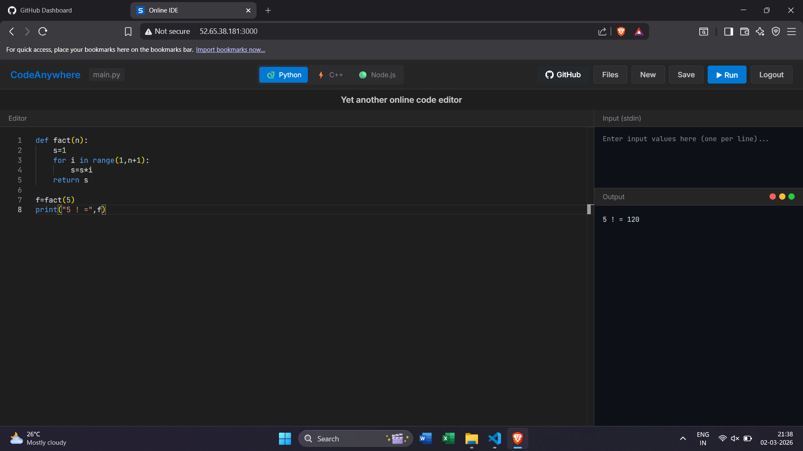

# 💻 Online IDE

> A modern, web-based code editor with real-time execution across multiple programming languages.

A powerful online IDE that lets you write, run, and save code in Python, C++, and Node.js—all in your browser with containerized, secure execution.

## ✨ Features

- **🎨 Monaco Editor**: Professional syntax highlighting and autocomplete (same engine as VS Code)
- **🌐 Multi-language Support**: Python 3.11 | C++ (GCC 13) | Node.js 20
- **🐳 Docker Isolation**: Secure, containerized execution with resource limits
- **💾 File Management**: Save and load your projects from MongoDB
- **⚡ Real-time Output**: Instant console feedback and error messages
- **📱 Responsive UI**: Optimized for desktop and tablet
- **🔒 Safety First**: Non-root execution, memory limits, timeout protection

## 📸 Screenshots

### Main Editor Interface



## 🏗️ Architecture

```
┌─────────────────────────────────────────────────────────────────┐
│                    ONLINE IDE SYSTEM                            │
└─────────────────────────────────────────────────────────────────┘

    ┌──────────────┐         ┌──────────────┐      ┌────────────┐
    │   Frontend   │────────>│   Backend    │─────>│  MongoDB   │
    │    React     │         │  Express.js  │      │  Database  │
    └──────────────┘         └──────┬───────┘      └────────────┘
         :3000                      │
                                    ▼
                        ┌────────────────────────┐
                        │    Docker Engine       │
                        ├────────────────────────┤
                        │ ┌──────┬──────┬──────┐ │
                        │ │Python│ C++  │Node  │ │
                        │ │ 3.11 │ GCC13│  20  │ │
                        │ └──────┴──────┴──────┘ │
                        └────────────────────────┘
                              :5000
```

**Technology Stack:**
- **Frontend**: React 18, Monaco Editor, Axios
- **Backend**: Node.js, Express.js, MongoDB, Docker API
- **Execution**: Docker containers with resource isolation
- **Database**: MongoDB for persistent file storage

## ⚙️ Prerequisites

- **Docker** & **Docker Compose** (latest version)
- **Git** (for cloning the repository)
- **8GB RAM** minimum (for running containers)
- **Port availability**: 3000 (frontend), 5000 (backend)

## 🚀 Quick Start

### Option 1: Docker Compose (Recommended)

1. **Clone the repository**
   ```bash
   git clone https://github.com/yourusername/online-IDE.git
   cd online-IDE
   ```

2. **Start all services**
   ```bash
   docker compose up --build
   ```

3. **Access the application**
   - 🌐 Frontend: [http://localhost:3000](http://localhost:3000)
   - 🔌 Backend API: [http://localhost:5000](http://localhost:5000)
   - 📊 MongoDB: mongodb://localhost:27017

   The application should be ready in 30-60 seconds.

### Option 2: Local Development

**Backend Setup:**
```bash
cd backend
npm install
npm run dev
# Backend runs on http://localhost:5000
```

**Frontend Setup:**
```bash
cd frontend
npm install
REACT_APP_API_URL=http://localhost:5000/api npm start
# Frontend runs on http://localhost:3000
```

> **Note**: Requires MongoDB running locally or accessible via connection string

## 📖 Usage Guide

### Writing Code
1. Select your preferred language from the **Language Selector** dropdown
2. Write your code in the **Monaco Editor** with full syntax highlighting
3. Provide input (if needed) in the **Input (stdin)** section

### Running Code
- Click the **▶ Run** button to execute
- Output appears in the **Output Terminal** in real-time
- Errors are displayed with full stack traces

### Managing Files
- **Save**: Click **Save** to store files in the database
- **New**: Click **New** to start a fresh file
- **Files**: Click **Files** to view and load saved files

### Keyboard Shortcuts
| Shortcut | Action |
|----------|--------|
| `Ctrl+S` / `Cmd+S` | Save file |
| `Ctrl+Enter` | Execute code |
| `Ctrl+/` | Toggle comment |

## 🔌 API Reference

### Execute Code
Execute code in any supported language with optional stdin.

```http
POST /api/execute
Content-Type: application/json
```

**Request Body:**
```json
{
  "code": "print('Hello, World!')",
  "language": "python",
  "stdin": ""
}
```

**Response:**
```json
{
  "success": true,
  "output": "Hello, World!\n",
  "error": null,
  "exitCode": 0,
  "executionTime": 245
}
```

**Supported Languages:**
- `python` - Python 3.11
- `cpp` - C++ with GCC 13
- `nodejs` - Node.js 20

---

### File Management

#### List All Files
```http
GET /api/files
```

**Response:**
```json
{
  "success": true,
  "files": [
    {
      "_id": "507f1f77bcf86cd799439011",
      "name": "hello.py",
      "language": "python",
      "createdAt": "2026-02-18T10:30:00Z",
      "updatedAt": "2026-02-18T10:30:00Z"
    }
  ]
}
```

#### Get Single File
```http
GET /api/files/:id
```

#### Create File
```http
POST /api/files
Content-Type: application/json

{
  "name": "script.py",
  "language": "python",
  "content": "print('Hello')"
}
```

#### Update File
```http
PUT /api/files/:id
Content-Type: application/json

{
  "name": "updated.py",
  "content": "print('Updated')"
}
```

#### Delete File
```http
DELETE /api/files/:id
```

## 📁 Project Structure

```
online-IDE/
├── 📄 docker-compose.yml        # Docker orchestration configuration
├── 📄 README.md                 # This file
├── backend/                     # Express.js backend server
│   ├── Dockerfile
│   ├── package.json
│   └── src/
│       ├── server.js            # Main Express application
│       ├── models/
│       │   ├── File.js          # MongoDB file schema
│       │   └── userModel.js     # User schema (future)
│       ├── routes/
│       │   ├── execute.js       # Code execution endpoints
│       │   └── files.js         # File CRUD endpoints
│       └── services/
│           └── dockerService.js # Docker container management
├── frontend/                    # React application
│   ├── Dockerfile
│   ├── nginx.conf               # Production server config
│   ├── package.json
│   ├── public/
│   │   └── index.html           # Entry point
│   └── src/
│       ├── App.js               # Main component
│       ├── index.js             # React entry point
│       ├── components/
│       │   ├── CodeEditor.js    # Monaco Editor wrapper
│       │   ├── OutputTerminal.js# Output display
│       │   ├── FileManager.js   # File browser
│       │   └── LanguageSelector.js  # Language picker
│       ├── services/
│       │   └── api.js           # HTTP client
│       └── styles/
│           ├── App.css          # Main styles
│           └── index.css        # Global styles
└── Docker/                      # Execution environments
    ├── python/
    │   └── Dockerfile           # Python 3.11 runtime
    ├── cpp/
    │   └── Dockerfile           # C++ GCC 13 runtime
    └── nodejs/
        └── Dockerfile           # Node.js 20 runtime
```

## 🔒 Security Features

Our execution environment is hardened against malicious code:

| Feature | Specification |
|---------|---------------|
| **Isolation** | Each execution runs in a dedicated Docker container |
| **Memory Limit** | 128MB per container |
| **CPU Limit** | 1 CPU core per container |
| **Execution Timeout** | 30 seconds maximum |
| **Network Access** | Disabled (no internet access) |
| **User Privileges** | Non-root user execution |
| **File System** | Read-only code mounting |
| **Resource Cleanup** | Automatic container termination after execution |

**No Guarantees**: This IDE is not suitable for untrusted malicious code. Use it only for education, testing, and development.

## 📊 Supported Languages

| Language | Version | Runtime Image |
|----------|---------|----------------|
| **Python** | 3.11 | `online-ide-python` |
| **C++** | GCC 13 | `online-ide-cpp` |
| **Node.js** | 20 | `online-ide-nodejs` |

### Python Example
```python
def factorial(n):
    if n <= 1:
        return 1
    return n * factorial(n - 1)

print(f"5! = {factorial(5)}")
```

### C++ Example
```cpp
#include <iostream>
using namespace std;

int main() {
    cout << "C++ is awesome!" << endl;
    return 0;
}
```

### Node.js Example
```javascript
const greet = (name) => `Hello, ${name}!`;
console.log(greet("World"));
```

## 🐛 Troubleshooting

### Docker Compose Fails to Start
```bash
# Check Docker daemon is running
docker ps

# View detailed logs
docker compose logs -f

# Rebuild images
docker compose down
docker compose up --build
```

### Port Already in Use
```bash
# Find process using port 3000
lsof -i :3000

# Kill the process
kill -9 <PID>

# Or change ports in docker-compose.yml
```

### Code Execution Timeout
- Increase timeout in `backend/src/services/dockerService.js`
- Default is 30 seconds
- Maximum recommended: 60 seconds

### MongoDB Connection Issues
```bash
# Check MongoDB container
docker compose ps

# View MongoDB logs
docker compose logs mongodb
```

### Frontend Can't Connect to Backend
- Verify backend is running: `curl http://localhost:5000/health`
- Check `REACT_APP_API_URL` environment variable
- Ensure firewall isn't blocking port 5000

## 🤝 Contributing

Contributions are welcome! Please follow these steps:

1. **Fork** the repository
2. **Create** a feature branch: `git checkout -b feature/amazing-feature`
3. **Commit** changes: `git commit -m 'Add amazing feature'`
4. **Push** to branch: `git push origin feature/amazing-feature`
5. **Submit** a Pull Request

### Development Guidelines
- Follow existing code style
- Add tests for new features
- Update documentation
- Keep commit messages clear and descriptive

## 📝 License

This project is licensed under the **MIT License** - see the [LICENSE](LICENSE) file for details.

## 🙏 Acknowledgments

- [Monaco Editor](https://microsoft.github.io/monaco-editor/) - Code editor
- [React](https://react.dev/) - UI framework
- [Docker](https://www.docker.com/) - Containerization
- [MongoDB](https://www.mongodb.com/) - Database
- [Express.js](https://expressjs.com/) - Backend framework

## 📧 Support & Contact

- **Issues**: Report bugs via [GitHub Issues](https://github.com/yourusername/online-IDE/issues)
- **Discussions**: Join our [GitHub Discussions](https://github.com/yourusername/online-IDE/discussions)
- **Email**: support@example.com

---

<div align="center">

**Made with ❤️ by the Online IDE Team**

[GitHub](https://github.com/yourusername/online-IDE) • [Live Demo](https://online-ide.example.com)

</div>
